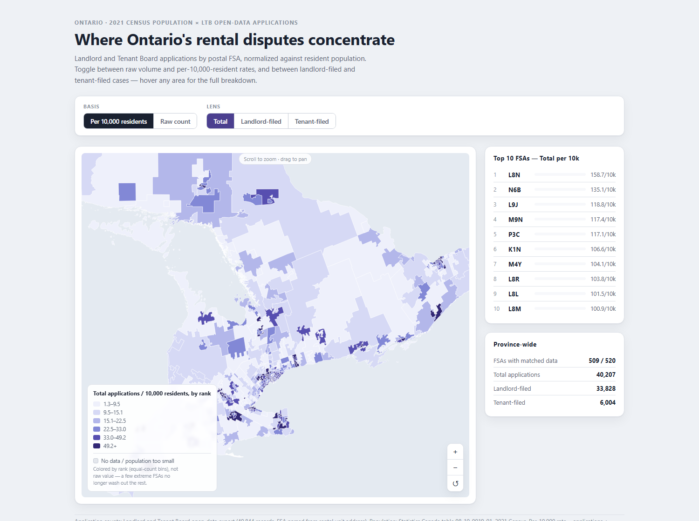

# Ontario LTB Data

What Ontario's own public records show about who wins at the Landlord and Tenant Board, and where disputes concentrate — built entirely from open data: the LTB's own order export and Statistics Canada's census.

**[→ Open the interactive map](https://arashjenab.github.io/ontario-ltb-data/map.html)** · **[→ Read the 2-page summary](reports/executive-summary.md)**



## The headline numbers

- **Landlords file 5.7× more often than tenants** — 34,422 landlord-filed applications vs. 6,043 tenant-filed, out of 40,844 total. This is an exact count of the full public dataset, not an estimate.
- **Landlords are awarded an estimated 26–74× more money than tenants** — roughly $130M in landlord-side awards (non-payment of rent, breach of settlement, other evictions) vs. $4.9M in tenant-side awards (rebates, maintenance remedies, compensation), depending on sampling design. See [`reports/executive-summary.md`](reports/executive-summary.md) for the range and methodology.
- **Dispute activity is geographically concentrated** — once normalized by population, the highest-activity postal areas (Hamilton's L8N, London's N6B, parts of Etobicoke, Sudbury, Ottawa) run ~7× the provincial median rate. Raw volume alone points somewhere else entirely: Toronto's M3N has the single highest case count in the province but drops to 11th once population is accounted for.

## What's here

| | |
|---|---|
| **[`map.html`](map.html)** | Interactive, zoomable choropleth of all 520 Ontario FSAs — toggle raw counts vs. per-10,000-resident rates, and total vs. landlord-filed vs. tenant-filed. Self-contained, works offline. |
| **[`reports/executive-summary.md`](reports/executive-summary.md)** | 2-page summary of all three findings above, written for a general/policy audience. |
| **[`data/`](data/)** | Source data (the LTB export, the StatsCan population table) and every derived dataset, each documented in its own README. |
| **[`results/`](results/)** | Every chart and CSV behind the findings above, organized one folder per analysis, each with the exact numbers, the command that built it, and its caveats. |
| **[`scripts/`](scripts/)** | The full pipeline, in Python — reproducible end to end from the two source files in `data/`. |

## Reproduce it yourself

```bash
pip install pandas matplotlib pymupdf pytesseract pillow requests shapely numpy
# Tesseract-OCR must also be installed separately (system package, not pip) — only
# needed for the ~1% of order PDFs that are scanned images rather than native text.

python scripts/make_chart.py                                    # application volume by category
python scripts/postal_analysis.py                                # raw application counts by FSA
python scripts/normalize_fsa_by_population.py                    # + population-normalized rates
python scripts/extract_amounts.py --n 100 \
  --outdir results/amounts_equal_sample_100_per_category         # dollar-amount extraction (downloads PDFs)
python scripts/make_perspective_chart.py --n 100 \
  --outdir amounts_equal_sample_100_per_category                 # landlord vs. tenant $ chart
python scripts/fetch_fsa_boundaries.py                           # Ontario FSA polygons (~94MB, not kept in repo)
python scripts/simplify_fsa_boundaries.py
python scripts/build_fsa_map_data.py
python scripts/build_fsa_map_html.py                             # -> the interactive map
```

Full detail, exact flags, and what each output means: every folder under `results/` and `data/` has its own README. `scripts/extract_amounts.py --help` and `--allocation proportional` cover the two sampling designs used for the dollar-amount estimates.

**Not included in this repo**: the ~600 downloaded order PDFs used for the dollar-amount extraction (would be several GB; `scripts/extract_amounts.py` re-downloads and caches them locally into a git-ignored `pdfs/` folder on demand) and the raw 94MB pre-simplification FSA boundary file (`scripts/fetch_fsa_boundaries.py` re-fetches it if you need a different simplification tolerance).

## Data sources & licensing

Built from two public sources — no private or scraped data:

- **Ontario Landlord and Tenant Board**, open-data order export (40,844 records)
- **Statistics Canada**, table 98-10-0019-01, *Population and dwelling counts: Canada and forward sortation areas*, 2021 Census, plus the corresponding Cartographic Boundary Files

See [`DATA_SOURCES.md`](DATA_SOURCES.md) for full attribution and license terms for both. The code in this repository is [MIT-licensed](LICENSE); the underlying government data remains subject to its own open-government license terms, not this repo's license.

## A note on the estimates

Application-count and geographic figures are exact counts of the full public dataset — no sampling involved. Dollar-amount figures required downloading and reading a sample of order PDFs individually (the open-data export lists case metadata but not the amount each order states), so those numbers are **estimates**, not a census, and are presented with the sampling method and margin discussion alongside them throughout. Nothing here should be read as more precise than it actually is — see [`reports/executive-summary.md`](reports/executive-summary.md) and the relevant `results/` folders for exactly how each number was produced.
