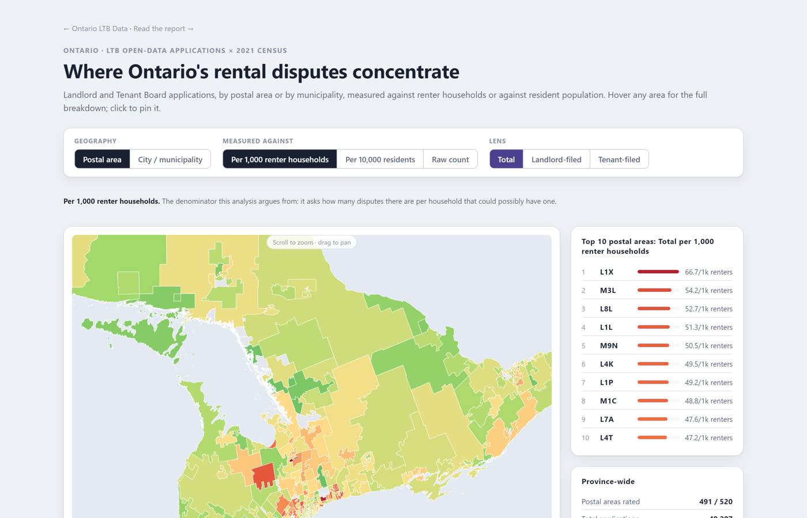

# Ontario LTB Data

What Ontario's own public records show about its rental disputes: how many there are, who brings them, what they cost, and who carries the cost. Built entirely from open data: the Landlord and Tenant Board's order export and Statistics Canada's census.

**[→ Read the report](https://arashjenab.github.io/ontario-ltb-data/report.html)** · **[→ One-page briefing](https://arashjenab.github.io/ontario-ltb-data/onepager.html)** · **[→ Interactive map](https://arashjenab.github.io/ontario-ltb-data/map.html)** · **[→ Sources](https://arashjenab.github.io/ontario-ltb-data/sources.html)**



## Read this first

**What period it covers.** Orders the Landlord and Tenant Board issued from **2026-01-02 to 2026-06-30**: 180 days, not a full year and not all time. The file holds 49,269 orders across 44,743 distinct cases, because review and amended orders repeat a case. Annual figures in this repository are that window annualised, and say so wherever they appear.

**How current it is.** Retrieved from the province on **2026-10-01**. The newest order in the file was then 93 days old. That gap is the Board's, not this repository's: it adds orders to its catalogue in batches, about three months after they issue. The previous fetch, on 2026-08-13, ended at orders dated 2026-05-29.

**Whether it is straight from the Board.** Yes. Every count is taken from the Board's own [LTB Order Catalogue](https://data.ontario.ca/dataset/ltb-order-catalogue) on data.ontario.ca, through its public API. The catalogue does not carry amounts, rents, attendance or outcomes, so those are read from a sample of the order documents it links to (6,032 for the money figures, 7,230 across every application type for process and outcomes). Rates use Statistics Canada's 2021 Census.

The LTB publishes **one rolling current-year file**. No earlier period is published anywhere, so no trend can be measured yet. `scripts/fetch_ltb_orders.py` snapshots every fetch into `data/snapshots/`, which is the only way a historical series will ever exist.

## What it found

**The scale is ordinary; the distribution is not.** About **1 in 24** Ontario renter households has a landlord case filed against it each year. Three independent routes agree: this export annualised (1 in 23), this export counting distinct units (1 in 25), and the Board's own published intake for 2024-25 (1 in 24). That is roughly half the United States filing rate of ~8%. Meanwhile only about 1% of renters are actually evicted in a year, because an application is not an eviction.

**"Landlords" is not one group, and the aggregate hides it.** 10,873 individual owners bring 37.6% of cases; **84.3% of them file exactly once and 90.5% own a single address**. For them this is a one-time event at their only property. The 5,121 corporate and institutional owners bring 62.4%, at 4.6 cases each. Province-wide the estimated $148.8M at stake over the 180 days splits about one third / two thirds, because corporations bring more cases.

**Per case, though, the individual owner is hit harder.** Reading 6,032 order PDFs individually rather than modelling from category averages: the median individual owner is owed **$7,212 after 4.06 months without rent, which is 33.8% of that unit's annual gross revenue** before mortgage, tax or repairs. The corporate median is $5,062 after 3.13 months, or 26.1%. The 95% intervals on the two means do not overlap, so this is a real difference. Individual owners do rent costlier units ($1,950/month against $1,640), but the months figure controls for that and the gap survives. **23% of all orders are for more than six months of rent on a single unit.**

**Filing is not eviction, and now there is a number for it.** The disposition is not in the export, so this reads it out of the orders: **48.0% of landlord applications end in a termination order, but 46.6% of those are voidable** (the tenancy ends unless the tenant pays by a date). Net, about a quarter end a tenancy outright. For non-payment specifically, 49.6% end in termination and 75.6% of those are voidable.

**A tenant who brings a case usually loses it.** **43.4%** of tenant-filed applications are dismissed against **7.0%** of landlord-filed, a six-fold gap. Another 19.7% end with the landlord ordered to do something, 6.1% with a payment.

**The record is not a picture of eviction.** Non-payment is **63.7%** of the Board's landlord cases but only **8%** of the evictions tenants report to Statistics Canada. The reasons tenants most often give, that the landlord sold (37%) or wanted the unit (26%), usually end with the tenant leaving on a notice and leave no record. This cuts both ways: the file understates how often tenants lose housing, *and* it is not evidence about the frequency of the no-fault evictions it barely contains.

**A small group of tenants does behave differently.** 88% of tenants appear in exactly one case. The 12% who recur account for 22% of cases, and are taken to the Board for **breaching a settlement at 3.7x the rate** of one-time tenants. Most recur at the same address rather than moving on.

**The two sides do not get the same process, and this one cuts the other way.** **18.5%** of landlord-filed orders are made without a hearing, against **2.1%** of tenant-filed ones. On attendance, part of the gap is structural, since the applicant turns up to their own case: tenants attend **70.5%** of hearings they bring against **51.3%** of those brought against them. Representation does not behave that way. Even bringing their own case tenants are represented **23.6%** of the time, against **50.9%** for landlords who are only responding to one.

**On gender, the split by case type is the only interesting part.** Individual landlords who file skew about **two men to one woman in every large category** (1.65 to 2.24), which reads as a fact about who owns rental property rather than about conduct. Tenants are taken to the Board at parity (1.01 to 1.07) but bring their own cases more often when they are women: maintenance **54.2%** women, bad-faith notice 52.7%, tenant rights 52.6%. Reported only alongside the share of names the dictionary resolves, because the misses are not random.

**Some things were tested and not found.** Area income barely predicts where landlords file (rank correlation -0.128, about 2% of the variation). There is no gendered pairing between the sides, and repeat tenants are not more male than one-time tenants (1.10 against 1.03). The serial-tenant claim is not supported at this timescale, and the apparent top of that list turns out to be legal clinics named in the tenant field.

## What's here

| | |
|---|---|
| **[`report.html`](report.html)** | The main artifact. Ten questions, each answered in a sentence before its chart, with what it means afterwards. |
| **[`onepager.html`](onepager.html)** | Print-ready one-page briefing. |
| **[`sources.html`](sources.html)** | Every source, its licence, its period, and which figure came from where. |
| **[`map.html`](map.html)** | One interactive choropleth with three toggles: postal area (520) or municipality (577); per 1,000 renter households, per 10,000 residents, or raw count; total, landlord-filed or tenant-filed. Opens on the renter-household rate. Self-contained, works offline. `city-map.html` is now a redirect to it. |
| **[`results/`](results/)** | One folder per analysis, each with its CSVs, its exact numbers, the command that built it, and its caveats. |
| **[`data/`](data/)** | Source data and every derived dataset, each documented. |
| **[`scripts/`](scripts/)** | The full pipeline in Python, reproducible end to end. |

## Reproduce it

```bash
pip install pandas matplotlib pymupdf pytesseract pillow requests shapely numpy \
            gender-guesser playwright
# Tesseract-OCR is a separate system package, needed only for the ~1% of order
# PDFs that are scanned images rather than native text.

# --- data ---------------------------------------------------------------
python scripts/fetch_ltb_orders.py            # the LTB export (also snapshots it)
python scripts/fetch_fsa_census_profile.py    # census profile by FSA: renter
                                              # households, income, rent, core need

# --- analysis -----------------------------------------------------------
python scripts/analyze_who_pays.py            # individual vs corporate, concentration,
                                              # the dollar estimate disaggregated
python scripts/analyze_exposure.py            # denominators, the reason mismatch,
                                              # income correlations by area
python scripts/analyze_parties.py             # repeat tenants, ex parte, gender

# Two PDF samples, each proportional within its own frame. The money one is
# weighted across L1/L2/L4 only, which is the right frame for "what a landlord
# money case costs" and the wrong one for anything about process, since the
# landlord is the applicant in every order in it.
python scripts/extract_case_details.py --n 5000                    # -> results/case_details/
python scripts/analyze_burden.py                  # months of rent owed, with intervals
python scripts/extract_case_details.py --n 6000 --categories all   # -> results/case_details_all/
python scripts/analyze_process.py                 # attendance and representation, by filer
python scripts/extract_outcomes.py                # what each order decided, from the cached PDFs
python scripts/analyze_outcomes.py                # termination, voidable, dismissed, by filer

# After a data refresh the samples are extended, not redrawn: every order already
# read is kept and only the newly published ones are sampled, at the same
# fraction. The 2026-10-01 refresh added 1,032 and 1,230 orders this way.
python scripts/extract_case_details.py --top-up-after 2026-05-29
python scripts/extract_case_details.py --categories all --top-up-after 2026-05-29
python scripts/extract_amounts.py --outdir amounts_equal_sample_100_per_category --top-up-after 2026-05-29
python scripts/make_perspective_chart.py --n 100 --outdir amounts_equal_sample_100_per_category
                                                  # the dollar sample behind the province-wide
                                                  # estimate; run before analyze_who_pays.py

# --- the older per-topic folders (counts by type, area, city; landlord/tenant overview)
python scripts/make_chart.py
python scripts/make_city_chart.py                 # after join_fsa_to_csd.py, below
python scripts/make_overview_chart.py

# --- the map ------------------------------------------------------------
python scripts/postal_analysis.py             # case counts per postal area
python scripts/normalize_fsa_by_population.py
python scripts/build_fsa_map_data.py
python scripts/join_fsa_to_csd.py             # rolls FSA counts AND renter households
                                              # up to municipalities, area-weighted
python scripts/build_csd_map_data.py
python scripts/build_map_data.py              # merges both geographies into one payload
python scripts/build_map_html.py              # -> map.html
python scripts/check_map.py                   # drives all 18 geography x denominator
                                              # x lens combinations in a browser

# --- the site -----------------------------------------------------------
python scripts/build_site.py                  # report, sources, one-pager, index, summary
python scripts/check_pages.py                 # renders all four, light and dark,
                                              # desktop and phone, fails on overflow
```

The boundary fetch and simplification steps that feed the map are unchanged and only need re-running if you want a different simplification tolerance; see `scripts/fetch_*_boundaries.py` and `scripts/simplify_*_boundaries.py`.

`scripts/ltbdata.py` is the shared loader: it defines once what counts as a corporate landlord, how a name cell splits into people, and the difference between an order and a case. Every analysis imports it.

**Not in this repository**: the order PDFs (`extract_*.py` re-download and cache them into a git-ignored `pdfs/`), the ~95MB raw boundary files, and the ~68MB raw census profile download. All are regenerated on demand.

## The two kinds of number here

**Exact counts.** Case volumes, application types, party classification, geography and ex parte rates are counted from the complete public export. No sampling. Exact for the window stated above.

**Estimates.** Every dollar figure. The export lists case metadata but not the amount each order states, so amounts come from downloading and reading order PDFs. Those are samples with a stated method, presented with their sample size and, in `results/burden/`, bootstrap confidence intervals. They are order-of-magnitude, not precise.

## Data sources & licensing

- **Ontario Landlord and Tenant Board**, order catalogue (Open Government Licence, Ontario)
- **Statistics Canada** (Statistics Canada Open Licence): Census Profile by FSA (98-401-X2021013), population by FSA (98-10-0019-01) and by municipality (98-10-0002-01), 2021 Cartographic Boundary Files
- **Tribunals Ontario** 2024-25 Annual Report, for the independent intake check
- **Statistics Canada** Canadian Housing Survey 2021 and **CMHC** (2025), for what tenants report and how many are actually evicted
- **The Eviction Lab**, Princeton University, for the international comparison

Full attribution, periods and caveats: [`sources.html`](sources.html) and [`DATA_SOURCES.md`](DATA_SOURCES.md). Code is [MIT-licensed](LICENSE); the underlying government data keeps its own terms.

## A note on what this is not

No landlord, tenant or address is named anywhere in these outputs. Where concentration or recurrence is reported it is as a distribution, not a list. Findings are reported in whichever direction they came out, including the ones that do not support the argument a reader might have arrived with.

This is an independent analysis developed using data published by the Government of Ontario. It is not an official publication of, and is not affiliated with or endorsed by, the Government of Ontario or the Landlord and Tenant Board.
