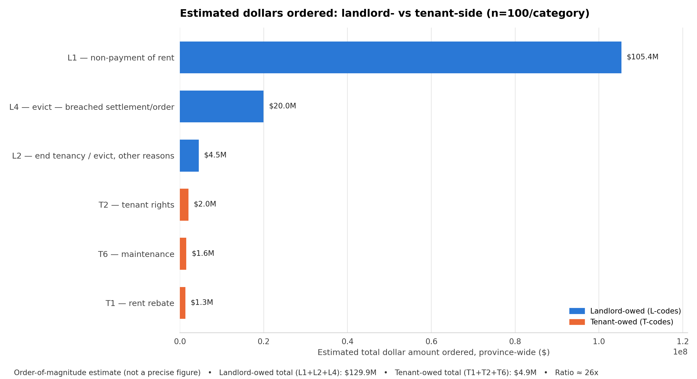

# Amounts — Equal Sample, n=100/category

**This is the primary sampling design cited in the [executive summary](../../reports/executive-summary.md).** 100 documents sampled from each of L1, L2, L4, T2, T6, T1 (600 PDFs total, seed=42) — same *n* regardless of how large that category actually is ("equal allocation").



## Files

| File | What it is |
|---|---|
| `extraction_raw.csv` | One row per sampled document: file number, category, extraction method (text/OCR), postal FSA, all dollar amounts found, the chosen primary amount + its type + matched context snippet (for manual spot-checking), notes |
| `extraction_summary.csv` | Per-category count / found-rate / min / max / median / mean, rolled up from `extraction_raw.csv` |
| `perspective_chart_data.csv` | Per-category population, sample_n, found_rate, sample_mean, and estimated_total ($) — the exact numbers behind each bar in the PNG above |
| `perspective_chart_totals.csv` | Landlord-owed total, tenant-owed total, and their ratio |
| `landlord_vs_tenant_perspective.png` | The chart itself |

## How it was built

```bash
python scripts/extract_amounts.py --n 100 --outdir amounts_equal_sample_100_per_category
python scripts/make_perspective_chart.py --n 100 --outdir amounts_equal_sample_100_per_category
```
Method: download each sampled order PDF → extract text (OCR fallback for scans) → find all dollar amounts with keyword context → pick the primary amount per document → `estimated_total(category) = population_count × found_rate × sample_mean`.

## Caveats

Equal allocation means each category gets equal *precision* on its own mean, but categories are not equally represented relative to their real size — a T1 document (1,041 total) had ~20x the selection probability of an L1 document (20,162 total), so this design over-weights small categories and under-weights large ones relative to the true population. See [`amounts_proportional_sample`](../amounts_proportional_sample/) for a design that corrects this (at the cost of much thinner samples for the small categories).

Amount extraction is inherently fuzzy — LTB order templates vary by adjudicator. Treat all figures here as best-effort estimates, not ground truth. ~5% of found primary amounts are tagged `ambiguous-max` in `extraction_raw.csv` (multiple candidate dollar figures, took the largest) — worth a manual look via the `matched_context` column before citing.
