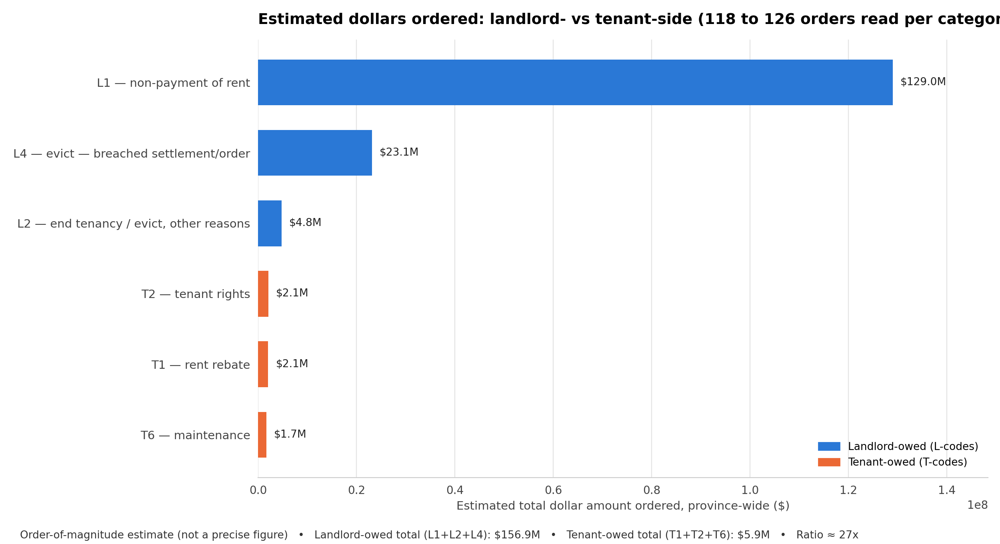

# Amounts: Equal Sample, about 120 per category

724 order documents, roughly the same number from each of L1, L2, L4, T2, T6 and T1 whatever the size of the category ("equal allocation"). This is the sample behind the province-wide dollar estimate on the site and in [`results/who_pays/`](../who_pays/).

Drawn in two steps. 100 per category were sampled in August 2026 from orders issued 2026-01-02 to 2026-05-29 (seed 42). When the export was refreshed on 2026-10-01, each category was topped up from the newly published June orders at the rate it was first drawn at, which added 18 to 26 per category. The folder keeps its original name.

| Category | Sampled | With an amount | Found rate | Median | Mean |
|---|---:|---:|---:|---:|---:|
| L1 | 120 | 89 | 74% | $5,069 | $7,186 |
| L2 | 121 | 43 | 36% | $1,170 | $2,083 |
| L4 | 121 | 87 | 72% | $4,140 | $5,136 |
| T2 | 118 | 29 | 25% | $1,461 | $3,254 |
| T6 | 118 | 39 | 33% | $1,800 | $4,001 |
| T1 | 126 | 84 | 67% | $1,568 | $2,353 |



Estimated totals for the 180-day window: **$156.9M** landlord side, **$5.9M** tenant side, a ratio of about 27x.

## Files

| File | What it is |
|---|---|
| `extraction_raw.csv` | One row per sampled document: file number, category, extraction method (text or OCR), postal FSA, every dollar amount found, the chosen primary amount with its type and a context snippet for spot-checking, notes |
| `extraction_summary.csv` | The table above |
| `manual_review.csv` | Amounts a person read and rejected, with the reason. See below. |
| `perspective_chart_data.csv` | Per-category population, sample size, found rate, sample mean and estimated total |
| `perspective_chart_totals.csv` | Landlord-side total, tenant-side total, and their ratio |
| `landlord_vs_tenant_perspective.png` | The chart |

## How it was built

```bash
python scripts/extract_amounts.py --n 100 --outdir amounts_equal_sample_100_per_category
python scripts/extract_amounts.py --outdir amounts_equal_sample_100_per_category --top-up-after 2026-05-29
python scripts/extract_amounts.py --outdir amounts_equal_sample_100_per_category --resummarise   # applies manual_review.csv
python scripts/make_perspective_chart.py --n 100 --outdir amounts_equal_sample_100_per_category
```
Method: download each sampled order, extract its text (OCR for scans), find every dollar amount with its surrounding words, pick the primary amount, then `estimated_total(category) = orders in category x found rate x sample mean`.

## Manual review

When the extractor cannot find an operative "It is ordered that" section it searches the whole document and takes the largest amount, tagging the row "manual review advised". Among the orders added in October, three of those on the tenant side were read and are not awards: $60,000 of rent a tenant had prepaid, a $26,800 payment a tenant had made, and $9,012 of arrears awarded to a landlord in a different order. Left in, they raised the tenant-side total from $5.9M to $7.6M. They are listed in `manual_review.csv` and counted as stating no amount.

Only the largest fallback amounts among the newly added rows were reviewed this way, on both sides. The August rows were spot-checked when they were drawn but not all re-read, so some error of this kind remains in both directions.

## Caveats

Equal allocation gives each category similar precision on its own mean, but a T1 order had about twenty times the chance of selection of an L1 order. The per-category figures are the strength of this design; for the overall comparison see [`amounts_proportional_sample`](../amounts_proportional_sample/).

Amount extraction is fuzzy because order templates vary by adjudicator. About 11% of primary amounts are tagged `ambiguous-max` (several candidates, the largest taken). Treat every figure here as an estimate. These are amounts written in orders: not a measure of who was right, and not money collected.
