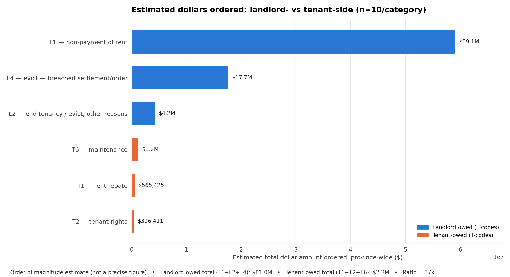

# Amounts — Equal Sample, n=10/category

The first pilot pass: 10 documents sampled from each of L1, L2, L4, T2, T6, T1 (60 PDFs total, seed=42) — same *n* regardless of how large that category actually is. Superseded in reliability by the [100-per-category](../amounts_equal_sample_100_per_category/) and [proportional-sample](../amounts_proportional_sample/) folders; kept here for the sampling-history record.



## Files

| File | What it is |
|---|---|
| `extraction_raw.csv` | One row per sampled document: file number, category, extraction method (text/OCR), all dollar amounts found, the chosen primary amount + its type + matched context snippet (for manual spot-checking), and notes |
| `extraction_summary.csv` | Per-category count / found-rate / min / max / median / mean, rolled up from `extraction_raw.csv` |
| `perspective_chart_data.csv` | Per-category population, sample_n, found_rate, sample_mean, and estimated_total ($) — the exact numbers behind each bar in the PNG above |
| `perspective_chart_totals.csv` | Landlord-owed total, tenant-owed total, and their ratio |
| `landlord_vs_tenant_perspective.png` | The chart itself |

## How it was built

```bash
python scripts/extract_amounts.py --n 10 --outdir amounts_equal_sample_10_per_category
python scripts/make_perspective_chart.py --n 10 --outdir amounts_equal_sample_10_per_category
```
Method: download each sampled order PDF → extract text (OCR fallback for scans) → find all dollar amounts with keyword context → pick the primary amount per document → `estimated_total(category) = population_count × found_rate × sample_mean`.

## Caveats

n=10/category is a very small, noisy sample — one or two outlier documents can swing a category's mean substantially (T2 here has only 1 document with a found amount out of 10 — treat that category's stats as illustrative only). Equal allocation also means a document in the small T1 category (1,041 total) had roughly 20x the chance of being selected as a document in L1 (20,162 total) — see [`amounts_proportional_sample`](../amounts_proportional_sample/) for a sample that corrects this.

Re-run 2026-08-12 after fixing several classifier bugs found while spot-checking the n=100 pass (line-wrap parsing, statutory boilerplate, line-item vs. stated-total confusion, "ordered on consent" phrasing, wrong-direction amounts in combined hearings) — this folder now uses the same extraction logic as `amounts_equal_sample_100_per_category` and `amounts_proportional_sample`, so the three are comparable on sample design alone, not code differences.
