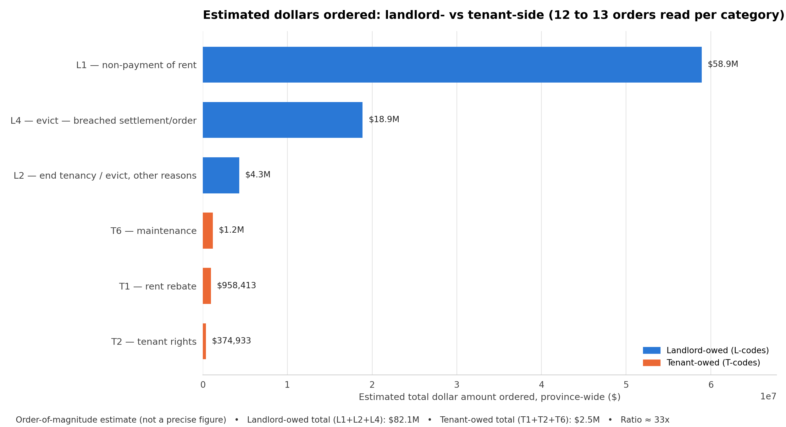

# Amounts: Equal Sample, pilot

The first pilot pass, kept for the sampling-history record: 10 documents from each of L1, L2, L4, T2, T6 and T1 (seed 42), drawn in August 2026. Topped up on 2026-10-01 from the June orders at the same rates, which added two or three per category, for 73 documents in all.

Superseded by [`amounts_equal_sample_100_per_category`](../amounts_equal_sample_100_per_category/) and [`amounts_proportional_sample`](../amounts_proportional_sample/). Nothing on the site uses this folder.



Estimated totals for the 180-day window: $82.1M landlord side, $2.5M tenant side, a ratio of about 33x.

## Files

| File | What it is |
|---|---|
| `extraction_raw.csv` | One row per sampled document: file number, category, extraction method, every dollar amount found, the chosen primary amount with its type and a context snippet, notes |
| `extraction_summary.csv` | Per-category count, found rate, min, max, median, mean |
| `perspective_chart_data.csv` | Per-category population, sample size, found rate, sample mean and estimated total |
| `perspective_chart_totals.csv` | Landlord-side total, tenant-side total, and their ratio |
| `landlord_vs_tenant_perspective.png` | The chart |

## How it was built

```bash
python scripts/extract_amounts.py --n 10 --outdir amounts_equal_sample_10_per_category
python scripts/extract_amounts.py --outdir amounts_equal_sample_10_per_category --top-up-after 2026-05-29
python scripts/make_perspective_chart.py --n 10 --outdir amounts_equal_sample_10_per_category
```

## Caveats

Twelve documents per category is a very small sample. One or two outliers can swing a category's mean, and T2 here has a single document with an amount, so treat every figure as illustrative only. It uses the same extraction code as the two larger samples, so the three differ in sample design alone.
