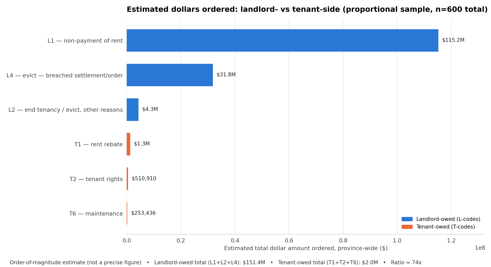

# Amounts — Proportional Sample, n=600 total

600 documents total, split across L1, L2, L4, T2, T6, T1 in proportion to each category's share of all applications ("proportional allocation" — every individual case in the population has roughly the same chance of being sampled, regardless of which category it's in).

| Category | Population | Share | Sample n |
|---|---:|---:|---:|
| L1 | 20,162 | 57.8% | 347 |
| L4 | 5,158 | 14.8% | 89 |
| L2 | 5,247 | 15.0% | 90 |
| T2 | 2,200 | 6.3% | 38 |
| T6 | 1,079 | 3.1% | 18 |
| T1 | 1,041 | 3.0% | 18 |
| **Total** | **34,887** | | **600** |



## Files

| File | What it is |
|---|---|
| `extraction_raw.csv` | One row per sampled document (same columns as the equal-sample folders) |
| `extraction_summary.csv` | Per-category count / found-rate / min / max / median / mean |
| `perspective_chart_data.csv` | Per-category population, sample_n, found_rate, sample_mean, and estimated_total ($) — the exact numbers behind each bar in the PNG above |
| `perspective_chart_totals.csv` | Landlord-owed total, tenant-owed total, and their ratio |
| `landlord_vs_tenant_perspective.png` | The chart itself |

## How it was built

```bash
python scripts/extract_amounts.py --n 600 --allocation proportional --outdir amounts_proportional_sample
python scripts/make_perspective_chart.py --n 600 --allocation proportional --outdir amounts_proportional_sample
```
Allocation uses largest-remainder apportionment: `n_i = round(600 × population_i / total_population)`, adjusted so the per-category sample sizes sum to exactly 600. See `allocate_proportional()` in `scripts/extract_amounts.py`.

## Caveats

This design gives the best precision on the **overall** landlord-vs-tenant total (the whole point — no category gets more or less influence on that total than its real-world size warrants). The cost: T2 (38 docs, only 5 with a found amount) and T6 (18 docs, only 4 with a found amount) are now too thin to say much about *those categories on their own* — their found-rate and mean here are noisier than the equal-sample-100 folder's T2/T6 numbers. If you want a per-category read on T1/T2/T6 specifically, use [`amounts_equal_sample_100_per_category`](../amounts_equal_sample_100_per_category/) instead; use this folder for the aggregate landlord-vs-tenant comparison.
