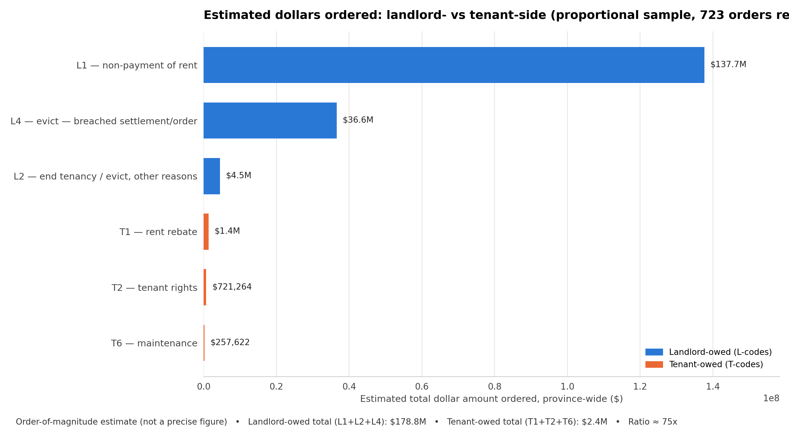

# Amounts: Proportional Sample

723 order documents, split across L1, L2, L4, T2, T6 and T1 in proportion to each category's share of all orders, so every order has about the same chance of being read whichever category it is in.

Drawn in two steps. 600 were sampled in August 2026 from orders issued 2026-01-02 to 2026-05-29. When the export was refreshed on 2026-10-01, 123 more were drawn from the newly published June orders at the same sampling rate, so the combined sample is still proportional.

| Category | Orders in the export | Share | Sampled |
|---|---:|---:|---:|
| L1 | 24,259 | 57.7% | 417 |
| L2 | 6,359 | 15.1% | 109 |
| L4 | 6,256 | 14.9% | 108 |
| T2 | 2,601 | 6.2% | 45 |
| T1 | 1,311 | 3.1% | 23 |
| T6 | 1,270 | 3.0% | 21 |
| **Total** | **42,056** | | **723** |



Estimated totals for the 180-day window: **$178.8M** landlord side, **$2.4M** tenant side, a ratio of about 76x.

## Files

| File | What it is |
|---|---|
| `extraction_raw.csv` | One row per sampled document (same columns as the equal-sample folders) |
| `extraction_summary.csv` | Per-category count, found rate, min, max, median, mean |
| `perspective_chart_data.csv` | Per-category population, sample size, found rate, sample mean and estimated total: the numbers behind each bar |
| `perspective_chart_totals.csv` | Landlord-side total, tenant-side total, and their ratio |
| `landlord_vs_tenant_perspective.png` | The chart |

## How it was built

```bash
python scripts/extract_amounts.py --n 600 --allocation proportional --outdir amounts_proportional_sample
python scripts/extract_amounts.py --outdir amounts_proportional_sample --top-up-after 2026-05-29
python scripts/make_perspective_chart.py --n 600 --allocation proportional --outdir amounts_proportional_sample
```
The first draw uses largest-remainder apportionment (`allocate_proportional()` in `scripts/extract_amounts.py`). The top-up draws each category's new orders at the fraction that category was first drawn at.

`estimated_total(category) = orders in category x found rate x sample mean`.

## Caveats

This design gives the best precision on the **overall** comparison, because no category has more influence on the total than its real size warrants. The cost is the small categories: T2 has 45 documents and only 7 with an amount, T6 has 21 and only 4. Their means here are too thin to quote on their own, and they are why this folder's tenant-side total is so much lower than the equal-sample folder's. For a per-category read on T1, T2 or T6 use [`amounts_equal_sample_100_per_category`](../amounts_equal_sample_100_per_category/).

These are amounts written in orders. They are not a measure of who was right, and not money collected.
