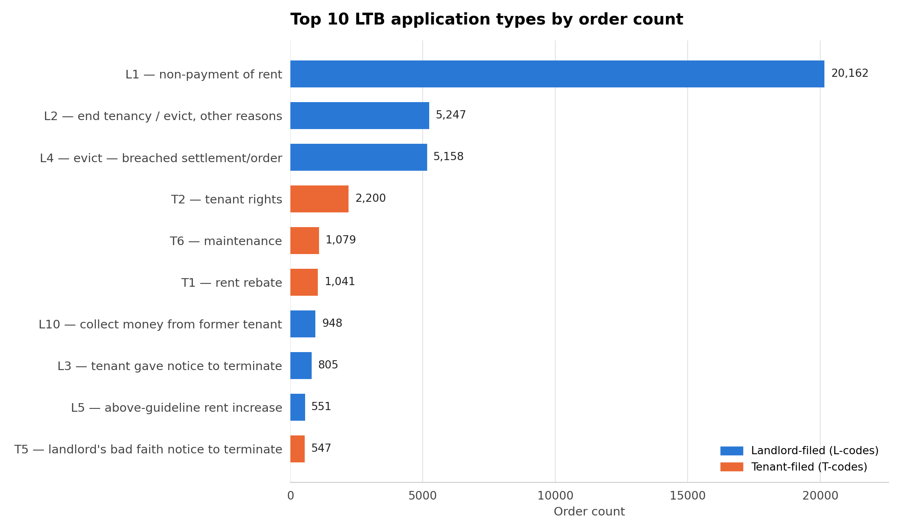

# Application Volume

Order counts for the 10 highest-volume LTB application types, computed over the **full population** of 40,844 records in the open-data export — no sampling, no PDF downloads, just a direct count.



## Files

| File | What it is |
|---|---|
| `top_categories_by_count.csv` | `code`, `full_name`, `filed_by` (landlord/tenant), `order_count` |
| `top_categories_by_count.png` | Horizontal bar chart of the same data |

## How it was built

```bash
python scripts/make_chart.py
```
Filters records where the `Applications/Requêtes` field matches exactly one of: L1, L2, L4, T2, T6, T1, L10, L3, T5, L5 (combo codes like `L1;L2` are excluded for a clean per-category count).

## Caveats

None — this is a full-population count, not a sample. The numbers are exact as of this export.
