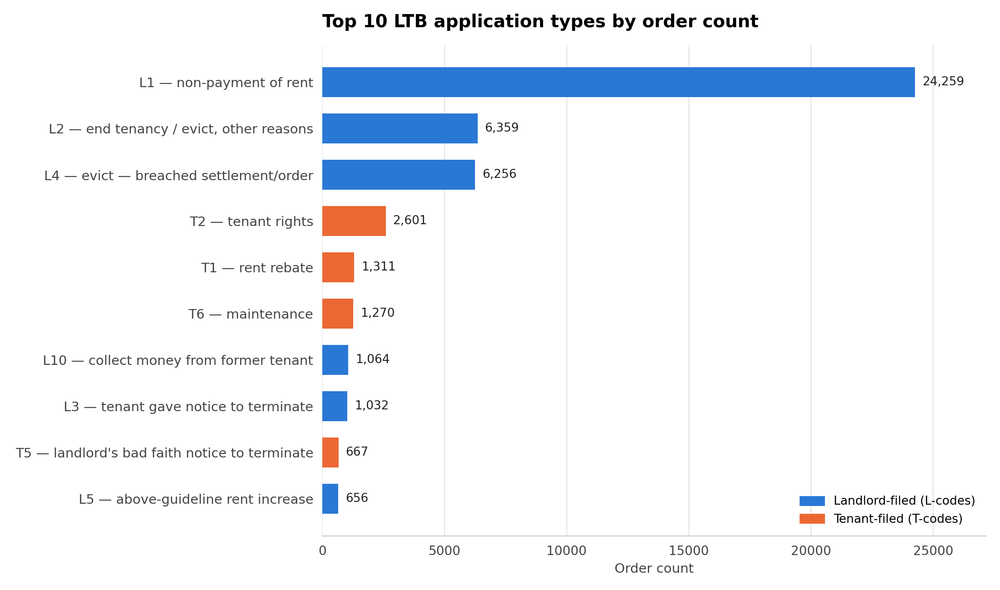

# Application Volume

Order counts for the 10 highest-volume LTB application types, counted over the **full export**: 49,269 orders issued 2026-01-02 to 2026-06-30, retrieved 2026-10-01. No sampling and no PDF downloads, just a direct count.

These are **orders the Board issued**, not applications filed. A case that produced a review or an amended order appears more than once.



| Code | What it is | Filed by | Orders |
|---|---|---|---:|
| L1 | Non-payment of rent | Landlord | 24,259 |
| L2 | End tenancy, other reasons | Landlord | 6,359 |
| L4 | Breached a settlement or order | Landlord | 6,256 |
| T2 | Tenant rights | Tenant | 2,601 |
| T1 | Rent rebate | Tenant | 1,311 |
| T6 | Maintenance | Tenant | 1,270 |
| L10 | Collect money from a former tenant | Landlord | 1,064 |
| L3 | Tenant gave notice to terminate | Landlord | 1,032 |
| T5 | Bad-faith notice to terminate | Tenant | 667 |
| L5 | Above-guideline rent increase | Landlord | 656 |

## Files

| File | What it is |
|---|---|
| `top_categories_by_count.csv` | `code`, `full_name`, `filed_by` (landlord/tenant), `order_count` |
| `top_categories_by_count.png` | Horizontal bar chart of the same data |

## How it was built

```bash
python scripts/make_chart.py
```
Counts records where the `Applications/Requêtes` field is exactly one of the ten codes above. Combined applications such as `L1;L2` are left out so each bar is a clean single-category count.

## Caveats

This is a full count, not a sample, and is exact for the 180-day window above. It is not a full year, and it is not scaled to one.
