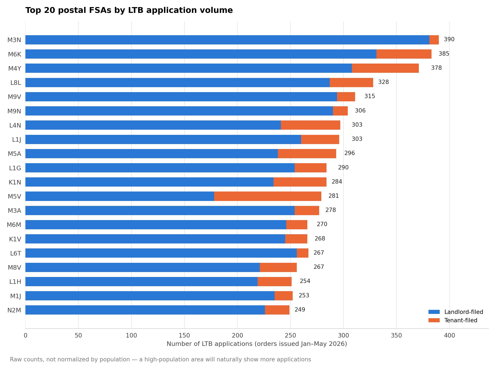
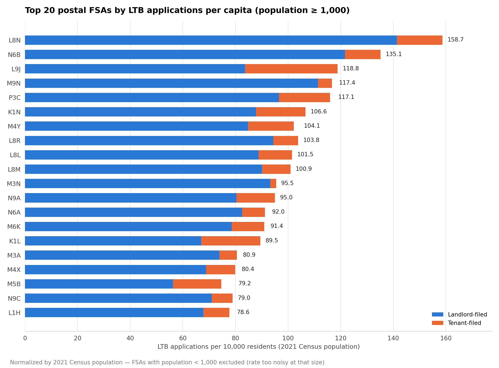

# Applications by Area

LTB application counts broken down by postal FSA (Forward Sortation Area — the first 3 characters of a Canadian postal code, e.g. `N6J`), both as raw volume and normalized by 2021 Census population. Computed over the **full population** of 40,844 records — no sampling, no PDF downloads, since the rental unit address (and therefore postal code) is already present in the open-data export for every record.

FSA, not full 6-character postal code, on purpose: a full postal code is often a single building and too granular to be meaningful; Statistics Canada publishes population data at the FSA level.

**→ [Open the interactive map](../../map.html)** — the live, zoomable version of the normalized view below.

## Files

| File | What it is |
|---|---|
| `fsa_application_counts.csv` | Every FSA found (524 of them): total applications, `landlord_filed`, `tenant_filed`, `coop_filed`, plus separate columns for the 6 tracked codes (L1, L2, L4, T2, T6, T1). **Raw counts.** |
| `top20_fsa_by_volume.png` | Top 20 FSAs by raw total volume. Answers "where do the most cases happen" — biased toward high-population areas, see Caveats. |
| `fsa_applications_normalized.csv` | `fsa_application_counts.csv` joined with 2021 Census population, plus `total_applications_per_10k`, `landlord_filed_per_10k`, `tenant_filed_per_10k`. **Normalized** — this is the one that actually answers "which areas are more problematic," not just "which areas are bigger." (Same file as [`data/fsa_applications_normalized.csv`](../../data/) — kept in both places so this folder stays a complete, self-contained answer on its own.) |
| `top20_fsa_by_rate_per_10k.png` | Top 20 FSAs by `total_applications_per_10k`, restricted to population ≥ 1,000 (see Caveats on why). **This is the chart to use for "which areas are problematic."** |

The interactive map itself lives at the [repo root](../../map.html) rather than duplicated in this folder — see below for what it does.




## The interactive map

A zoomable, pannable choropleth of all 520 Ontario FSAs, with **Basis** (per-10k / raw) and **Lens** (total / landlord / tenant) toggles, hover tooltips, and a live top-10 ranking. Self-contained — open [`map.html`](../../map.html) directly in a browser, no server or internet connection needed.

Defaults to a crop around the populated south rather than the full province (most of Ontario's land area has near-zero LTB activity) — scroll to zoom out, drag to pan, or hit the reset button (bottom-right) to return. Color is by quantile rank, not raw value — see Caveats.

## How it was built

```bash
python scripts/postal_analysis.py                  # -> fsa_application_counts.csv, top20_fsa_by_volume.png
python scripts/normalize_fsa_by_population.py       # -> fsa_applications_normalized.csv, top20_fsa_by_rate_per_10k.png
python scripts/fetch_fsa_boundaries.py              # -> data/ (FSA polygons, see data/README.md)
python scripts/simplify_fsa_boundaries.py           # -> data/ontario_fsa_simplified.geojson
python scripts/build_fsa_map_data.py                # -> data/fsa_map_payload.json
python scripts/build_fsa_map_html.py                # -> scripts/_build/fsa_dispute_map.html (copy to /map.html)
```

`postal_analysis.py` regexes a Canadian postal-code pattern out of each record's rental unit address field, keeps the first 3 characters as the FSA. 580/40,844 records (1.4%) have no extractable FSA, almost all because the address field says "Multiple Rental Units" instead of a specific address. `normalize_fsa_by_population.py` left-joins that against `data/fsa_population.csv` (Statistics Canada table 98-10-0019-01, 2021 Census) on `fsa`, and computes the per-10k columns. The map pipeline is documented in full in [`data/README.md`](../../data/).

## Caveats

- Raw counts (`fsa_application_counts.csv`, `top20_fsa_by_volume.png`) favor high-population areas almost by definition — more people means more tenancies means more disputes, independent of whether that area is unusually problematic. Use the normalized files for an actual "problem area" read.
- 12 of the 524 FSAs in the application data have no population match (likely retired/reassigned or non-residential FSAs) — all low-volume (max 17 applications). They're in `fsa_applications_normalized.csv` with population/rate columns blank, and excluded from the per-10k chart.
- Per-10k rates get noisy for low-population FSAs — a handful of applications in a small-population FSA can produce a misleadingly high rate. Both the printed "top 15" from `normalize_fsa_by_population.py` and the `top20_fsa_by_rate_per_10k.png` chart filter to population ≥ 1,000 for this reason; the saved CSV itself keeps every row unfiltered.
- This is 2021 Census population (all residents), not renter/rental-unit counts specifically — an FSA with a high owner-occupied share will show a lower application-per-10k-residents rate than its actual rental-market activity, since the denominator includes non-renters too.
- Every order in the source export was **issued** between January and May 2026 (a 5-month window); population is a single 2021 snapshot, so there's a uniform ~5-year gap between the two, worth keeping in mind for fast-growing FSAs.
- `map.html` colors by **quantile rank** (each of the 6 color steps holds an equal *count* of FSAs), not a linear value scale. This is deliberate: the raw distribution is heavily right-skewed (one FSA — population 19, 2 applications — posts a rate of 1,052/10k), and a linear min-max scale left nearly everything the same pale shade with that one outlier eating all the contrast. Quantile bins fix that, but it means the legend's bin edges shift depending on which Basis/Lens is selected — read the legend each time you switch, don't assume "dark purple" means the same rate across two different toggle states. FSAs with population < 1,000 are excluded from per-10k coloring entirely (shown as no-data grey) for the same reason the static chart filters them — the rate is too noisy to color meaningfully.
