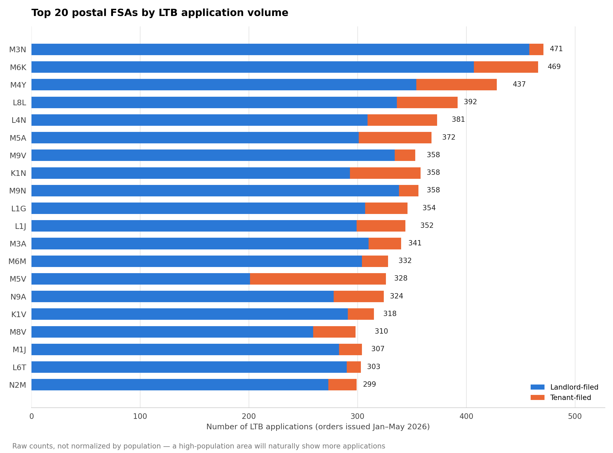
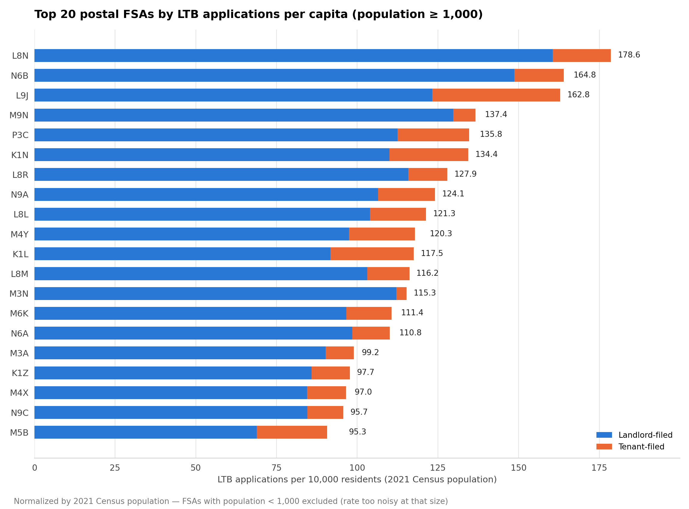

# Applications by Area

LTB order counts by postal FSA (Forward Sortation Area, the first three characters of a postal code, e.g. `N6J`), as raw volume and per 10,000 residents. Counted over the **full export**: 49,269 orders issued 2026-01-02 to 2026-06-30, retrieved 2026-10-01. No sampling and no PDF downloads, because the rental unit address is in the export for every record.

Counts and rates are for that 180-day window. They are **not scaled to a year**.

FSA rather than full postal code on purpose: a full postal code is often a single building, and Statistics Canada publishes population at the FSA level.

**[Open the interactive map](../../map.html)** for the live version, which also offers the renter-household rate the main report argues from.




## What it shows

The areas with the most orders are not the areas with the highest rates. By raw volume the top three are M3N (471), M6K (469) and M4Y (437), all in Toronto. Per 10,000 residents, among areas with at least 1,000 people, the top are L8N in Hamilton (179), N6B in London (165), L9J in Barrie (163), M9N in Toronto (137) and P3C in Sudbury (136). The median area runs at 27, so the highest is about 6.6 times the median.

## Files

| File | What it is |
|---|---|
| `fsa_application_counts.csv` | Every FSA found (530): total orders, `landlord_filed`, `tenant_filed`, `coop_filed`, and separate columns for L1, L2, L4, T2, T6, T1. **Raw counts.** |
| `top20_fsa_by_volume.png` | Top 20 FSAs by raw volume. Favours populous areas; see Caveats. |
| `fsa_applications_normalized.csv` | The same joined with 2021 Census population, plus `total_applications_per_10k`, `landlord_filed_per_10k`, `tenant_filed_per_10k`. Same file as [`data/fsa_applications_normalized.csv`](../../data/), kept here so this folder is complete on its own. |
| `top20_fsa_by_rate_per_10k.png` | Top 20 FSAs by rate, restricted to population of 1,000 or more. |

## How it was built

```bash
python scripts/postal_analysis.py                  # -> fsa_application_counts.csv, top20_fsa_by_volume.png
python scripts/normalize_fsa_by_population.py      # -> fsa_applications_normalized.csv, top20_fsa_by_rate_per_10k.png
python scripts/build_fsa_map_data.py               # -> data/fsa_map_payload.json
python scripts/join_fsa_to_csd.py                  # municipality rollup, see ../applications_by_city/
python scripts/build_csd_map_data.py
python scripts/build_map_data.py                   # merges both geographies, adds renter households
python scripts/build_map_html.py                   # -> /map.html
```

`postal_analysis.py` finds a postal code in each record's rental unit address and keeps the first three characters. 691 of 49,269 records (1.4%) have none, almost all because the address field reads "Multiple Rental Units". `normalize_fsa_by_population.py` joins the counts to `data/fsa_population.csv` (Statistics Canada table 98-10-0019-01, 2021 Census).

## Caveats

- Raw counts favour populous areas almost by definition. Use the rates to compare areas.
- A per-resident rate partly measures how many renters an area has. The renter-household rate on the map and in [`results/exposure/`](../exposure/) corrects for that, and is the one the report uses.
- 17 of the 530 FSAs have no population match (retired, reassigned or non-residential codes). All are low volume, 22 orders at most. They stay in the CSV with blank population and rate, and are left out of the rate chart.
- Rates are noisy where few people live. The rate chart and the printed top list keep only areas with 1,000 or more residents; the CSV keeps every row.
- Orders were **issued** in the first half of 2026; population is the 2021 Census. The five-year gap is uniform but matters for fast-growing areas.
