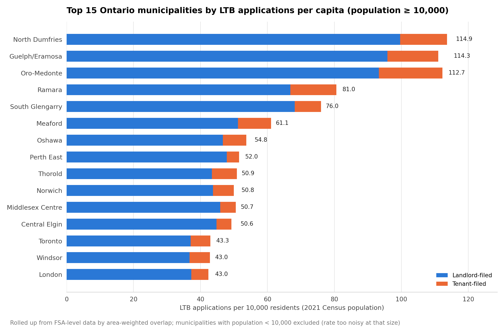

# Applications by City

The same LTB application data as [`applications_by_area`](../applications_by_area/), rolled up from postal FSA to **municipality** (Census Subdivision — Toronto, Hamilton, Burlington, Oakville, etc.) instead of postal codes, since most people recognize city names, not FSA codes.

**→ [Open the interactive city map](../../city-map.html)** — zoomable, toggles for raw/per-10k and total/landlord/tenant, same as the FSA map.



## Files

| File | What it is |
|---|---|
| `csd_applications_normalized.csv` | Every Ontario municipality with application data (564 of them): population, `total_applications`, `landlord_filed`, `tenant_filed`, `fsa_count` (how many FSAs — possibly fractional, see Method — contributed), and the three `*_per_10k` rate columns. Same file as [`data/csd_applications_normalized.csv`](../../data/), kept here too so this folder is a complete, self-contained answer on its own. |
| `top15_cities_by_rate_per_10k.png` | Top 15 municipalities by `total_applications_per_10k`, restricted to population ≥ 10,000 (see Caveats on why the floor is higher here than the FSA-level chart's). |

## Method: area-weighted overlap, not centroid assignment

FSAs and municipal boundaries don't align — an FSA can span parts of two municipalities. The first version of this used each FSA's centroid to assign it whole to one municipality, which works fine in cities (many small FSAs, each cleanly inside one municipality) but broke badly in rural areas: a single large rural FSA spanning several small townships would dump its *entire* application count onto whichever township happened to be nearest the centroid, producing absurd rates (one small town showed 1,539 applications per 10,000 residents from this alone).

The fix: **area-weighted overlap**. For each FSA, `scripts/join_fsa_to_csd.py` finds every municipality polygon it intersects and splits that FSA's application counts proportionally by the fraction of the FSA's area inside each one. A big-city FSA that's ~100% inside one municipality effectively still gets assigned there in full; a large rural FSA spanning three townships gets split three ways by area. `fsa_count` in the CSV reflects this — a value like `12.03` means roughly 12 FSAs' worth of (weighted) data went into that municipality, while `0.51` means a fractional slice of one FSA landed there.

This is still an approximation (it assumes applications are evenly spread across an FSA's area, which isn't strictly true — a rural FSA's cases likely cluster in its one small town, not spread evenly across surrounding farmland), but it's far more defensible than centroid assignment and removed essentially all of the extreme outliers it was producing.

## How it was built

```bash
python scripts/fetch_csd_population.py    # -> data/csd_population.csv (from the already-downloaded StatCan table 98-10-0002-01)
python scripts/fetch_csd_boundaries.py    # -> data/raw_csd_boundaries/ (~95MB, not kept in repo)
python scripts/simplify_csd_boundaries.py # -> data/ontario_csd_simplified.geojson
python scripts/join_fsa_to_csd.py         # -> data/csd_applications_normalized.csv (the area-weighted join)
python scripts/make_city_chart.py         # -> this folder's CSV copy + chart
python scripts/build_csd_map_data.py      # -> data/csd_map_payload.json
python scripts/build_csd_map_html.py      # -> ../../city-map.html
```

## Caveats

- **Higher population floor than the FSA-level view (10,000 vs. 1,000).** Ontario has many sparsely-populated "Unorganized" territories that are enormous in land area but tiny in registered population; area-weighted allocation from the huge rural FSAs overlapping them inflates their per-capita rate the same way small-population FSAs did at the postal-code level, just worse, because the mismatch in scale is larger. A 1,000 floor still let entries like "Sudbury, Unorganized, North Part" (population 2,902) post a 460/10k rate; 10,000 cleared essentially all of that out while keeping legitimate smaller towns.
- Even above the floor, municipalities built from only 1-2 FSAs (check `fsa_count`) are noisier than a city like Toronto built from 95. Treat single-digit-`fsa_count` entries with more caution than the major cities.
- Area-weighted overlap assumes uniform application density across an FSA's area — see Method above.
- 13 municipalities in the application data have no population match (mostly First Nations reserve lands not covered by the CSD population table used here) — present in the CSV with population/rate columns blank.
- Same underlying-data caveats as `applications_by_area` apply: 2021 Census population vs. a Jan–May 2026 order-issuance window, owner- vs. renter-occupied mix not accounted for, etc.
