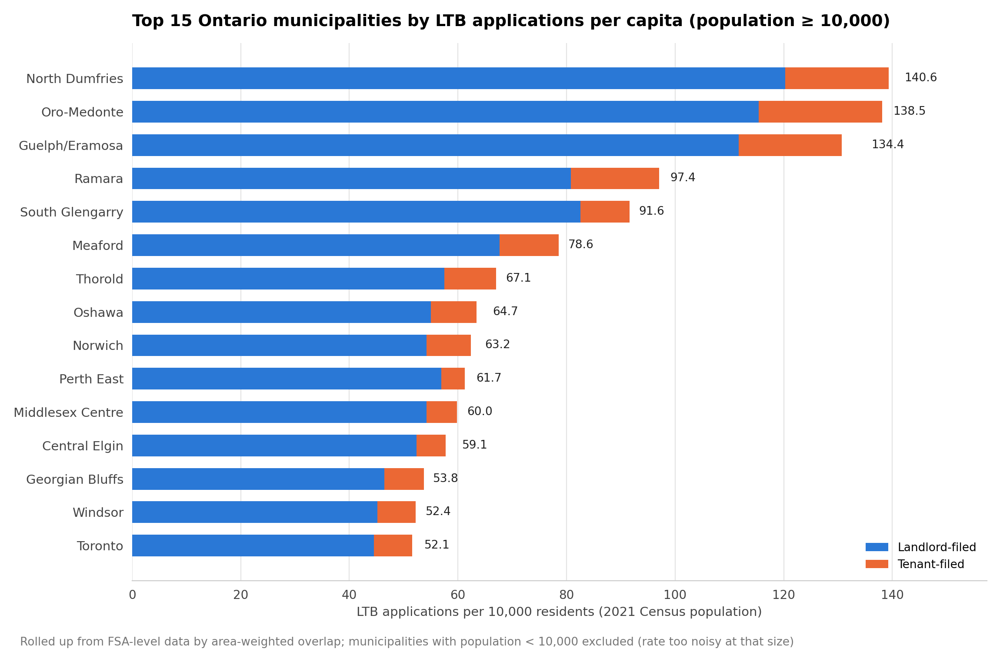

# Applications by City

The same order data as [`applications_by_area`](../applications_by_area/), rolled up from postal FSA to **municipality** (Census Subdivision: Toronto, Hamilton, Windsor and so on), because most people recognise a city name and not a postal prefix.

Built from the full export: 49,269 orders issued 2026-01-02 to 2026-06-30, retrieved 2026-10-01. Counts and rates are for that 180-day window and are **not scaled to a year**.

**[Open the interactive map](../../map.html)** and switch Geography to "City / municipality". The separate city map was merged into it.



## What it shows

By raw volume the largest are Toronto (about 14,560 orders), Ottawa (3,790), Hamilton (2,610), London (2,180) and Mississauga (2,140). Per 10,000 residents the large cities sit close together: Oshawa 65, Windsor 52, Toronto 52, London 52, Hamilton 46, Ottawa 37, Mississauga 30, against a median of 19 across the 151 municipalities with 10,000 or more people.

The very top of the rate chart is small townships such as North Dumfries, Oro-Medonte and Guelph/Eramosa. Each is built from about one postal area or less (`fsa_count` of 0.9 to 1.7), so those rates say more about the rollup method than about the township. Read them with the Caveats below.

## Files

| File | What it is |
|---|---|
| `csd_applications_normalized.csv` | All 577 Ontario municipalities: population, renter households, `total_applications`, `landlord_filed`, `tenant_filed`, `coop_filed`, `fsa_count` (how many FSAs, possibly fractional, contributed), and rates per 10,000 residents and per 1,000 renter households. Same file as [`data/csd_applications_normalized.csv`](../../data/). |
| `top15_cities_by_rate_per_10k.png` | Top 15 municipalities by rate per 10,000 residents, restricted to population of 10,000 or more. |

## Method: area-weighted overlap, not centroid assignment

FSAs and municipal boundaries do not align; an FSA can span parts of two municipalities. The first version assigned each FSA whole to the municipality nearest its centroid. That works in cities, where many small FSAs each sit inside one municipality, and fails in rural areas, where one large FSA spanning several townships put its entire count onto whichever was nearest the centroid.

The fix is **area-weighted overlap**. For each FSA, `scripts/join_fsa_to_csd.py` finds every municipality it intersects and splits the FSA's counts by the share of its area inside each. A city FSA that is about 100% inside one municipality is still assigned there in full; a rural FSA spanning three townships is split three ways. That is why a municipality can carry a fraction of an order.

It is still an approximation. It assumes orders are spread evenly across an FSA's area, when a rural FSA's cases likely cluster in its one town.

## How it was built

```bash
python scripts/postal_analysis.py         # -> ../applications_by_area/fsa_application_counts.csv
python scripts/join_fsa_to_csd.py         # -> data/csd_applications_normalized.csv (the area-weighted join)
python scripts/make_city_chart.py         # -> this folder's CSV copy and chart
python scripts/build_csd_map_data.py      # -> data/csd_map_payload.json
python scripts/build_map_data.py          # merges both geographies
python scripts/build_map_html.py          # -> /map.html
```

## Caveats

- **Higher population floor than the FSA view (10,000 against 1,000).** Ontario has many sparsely populated "Unorganized" territories that are enormous in area and tiny in population. Area-weighted allocation from the large rural FSAs overlapping them inflates their rate.
- Above the floor, municipalities built from one or two FSAs (check `fsa_count`) are noisier than a city like Toronto built from 95.
- 13 municipalities have no population match, mostly First Nations reserve lands not covered by the population table used. They are in the CSV with blank population and rate.
- The same caveats as `applications_by_area` apply: 2021 Census population against a 2026 order window, and a per-resident rate that partly measures how many renters a place has.
