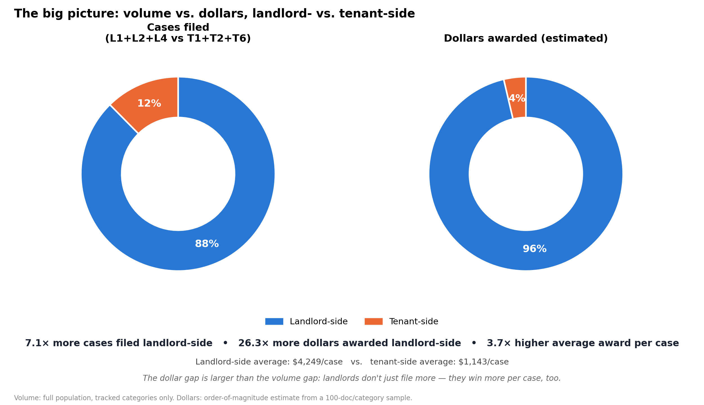

# Landlord vs. Tenant Overview

The "big picture" chart: cases filed and dollars awarded, landlord- vs. tenant-side, side by side — plus the average-award-per-case comparison, which turns out to be the sharper story.



## The numbers

| | Landlord-side | Tenant-side | Ratio |
|---|---:|---:|---:|
| Cases filed (L1+L2+L4 vs T1+T2+T6) | 30,567 | 4,320 | 7.1× |
| Dollars awarded (estimated) | $129,864,717 | $4,939,095 | 26.3× |
| **Average award per case** | **$4,249** | **$1,143** | **3.7×** |

The dollar gap (26.3×) is larger than the case-volume gap (7.1×) — landlords don't just file more often, they're also awarded roughly 3.7× more *per case*, on average, than tenants are. That per-case gap is what compounds a 7× filing disparity into a 26× dollar disparity.

## Why the same 6 categories for both halves

Comparing "all landlord filings" (any L-code) against "dollars from L1/L2/L4 only" would be apples-to-oranges — the volume side would include categories (L3, L5, L9, L10) that were never sampled for dollar amounts. Both donuts here use the identical six tracked categories (L1+L2+L4 landlord-side, T1+T2+T6 tenant-side — about 85% of all filings) so the volume-share and dollar-share percentages describe the same slice of the system. The province-wide filing ratio using *all* application types (not just these six) is 5.7×, not 7.1× — see the root README and `results/application_volume/`.

## Files

| File | What it is |
|---|---|
| `overview_data.csv` | `side`, `categories`, `cases_filed`, `estimated_dollars_awarded`, `avg_dollars_per_case` — the exact numbers behind the chart |
| `overview_chart.png` | The chart itself |

## How it was built

```bash
python scripts/make_overview_chart.py
```
Case counts: exact tally of `Applications/Requêtes` in the full 40,844-record export, filtered to L1+L2+L4 and T1+T2+T6. Dollar totals: pulled from [`results/amounts_equal_sample_100_per_category/perspective_chart_totals.csv`](../amounts_equal_sample_100_per_category/) (the 100-doc/category sampling design). Average-per-case = estimated dollars awarded ÷ cases filed for that side.

## Caveats

- Case-filing counts are exact (full population); dollar figures are estimates from a sample — see [`results/amounts_equal_sample_100_per_category/README.md`](../amounts_equal_sample_100_per_category/) for the sampling method and margin discussion, and the root [`reports/executive-summary.md`](../../reports/executive-summary.md) for how this ratio compares across three different sampling designs (26×–74×).
- "Average award per case" divides estimated total dollars by *all* cases filed in that category group, not just the ones where an amount was found/awarded — this is the right denominator for "expected value per case filed" (blending win-rate and award size), but is not the same as "average award, among cases where money was awarded."
