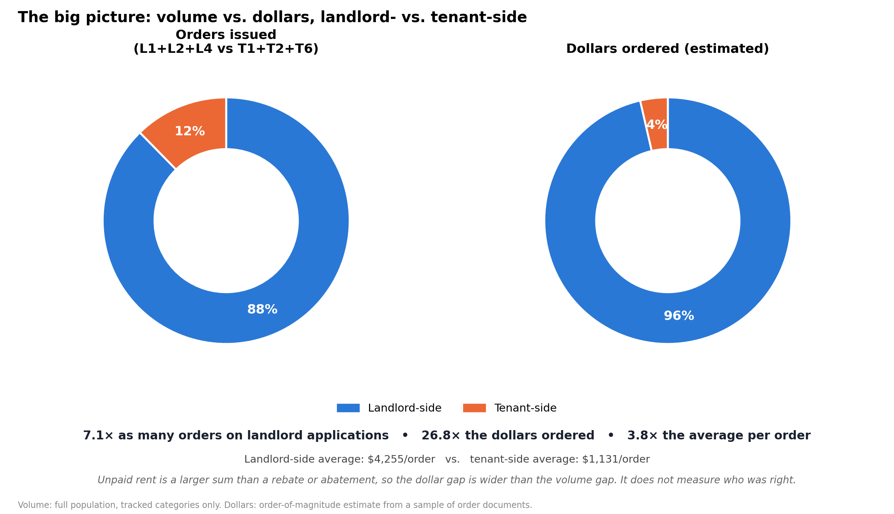

# Landlord vs. Tenant Overview

Orders issued and dollars ordered, landlord side against tenant side, for the six application types that were sampled for amounts. Built from the export of 49,269 orders issued 2026-01-02 to 2026-06-30, retrieved 2026-10-01.



## The numbers

| | Landlord side | Tenant side | Ratio |
|---|---:|---:|---:|
| Orders issued (L1+L2+L4 against T1+T2+T6) | 36,874 | 5,182 | 7.1x |
| Dollars ordered (estimated) | $156,904,738 | $5,859,045 | 26.8x |
| **Average per order** | **$4,255** | **$1,131** | **3.8x** |

The dollar gap is wider than the volume gap because the average landlord-side order is for a larger sum. That follows from what the applications are: most landlord applications are for months of unpaid rent, while tenant applications are for rebates and abatements, which are smaller amounts by nature.

**What this does not show.** It counts orders and the amounts written in them. It does not measure who was right, how often either side succeeds, or whether any of the money was ever collected. For outcomes see [`results/outcomes/`](../outcomes/); for what a case costs an individual owner see [`results/burden/`](../burden/). Those two, read from several thousand orders, supersede this folder wherever they overlap.

## Why the same six categories on both sides

Comparing every landlord application against dollars from L1, L2 and L4 only would mix two different sets. Both halves use the six sampled categories, which hold 85% of all orders, so the volume share and the dollar share describe the same slice. Across every application type the ratio of landlord-side to tenant-side orders is 5.7x (41,576 against 7,242), not 7.1x.

## Files

| File | What it is |
|---|---|
| `overview_data.csv` | `side`, `categories`, `orders_issued`, `estimated_dollars_ordered`, `avg_dollars_per_order` |
| `overview_chart.png` | The chart |

## How it was built

```bash
python scripts/make_overview_chart.py
```
Order counts are an exact tally of the full export. Dollar totals come from [`results/amounts_equal_sample_100_per_category/perspective_chart_totals.csv`](../amounts_equal_sample_100_per_category/). Average per order is the estimated dollars divided by all orders on that side.

## Caveats

- Order counts are exact. Dollar figures are estimates from a sample; across the three sampling designs in this repository the ratio runs from about 27x to 76x, which is the honest width of the uncertainty. See the sample folders for why.
- "Average per order" divides by every order on that side, including those that state no amount. It is an expected value per order, not the average among orders that awarded money.
- The window is 180 days and the dollar totals are for that window, not a year.
